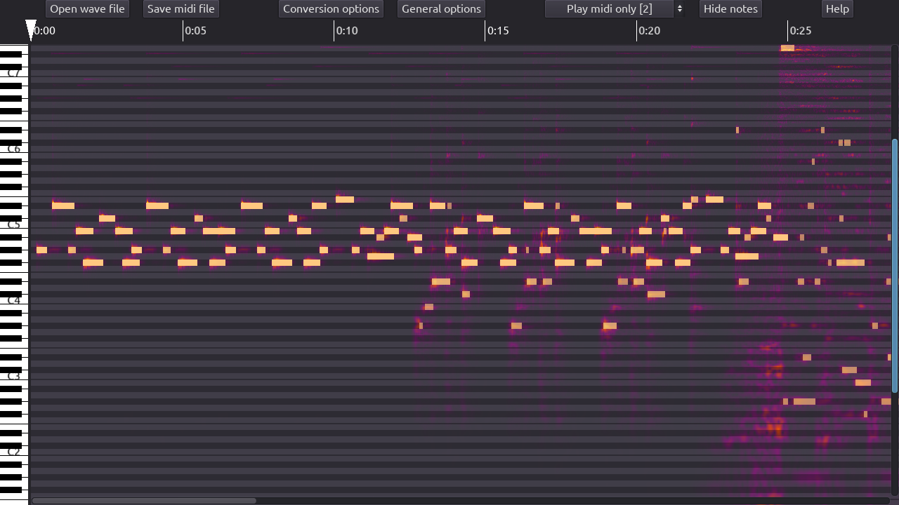
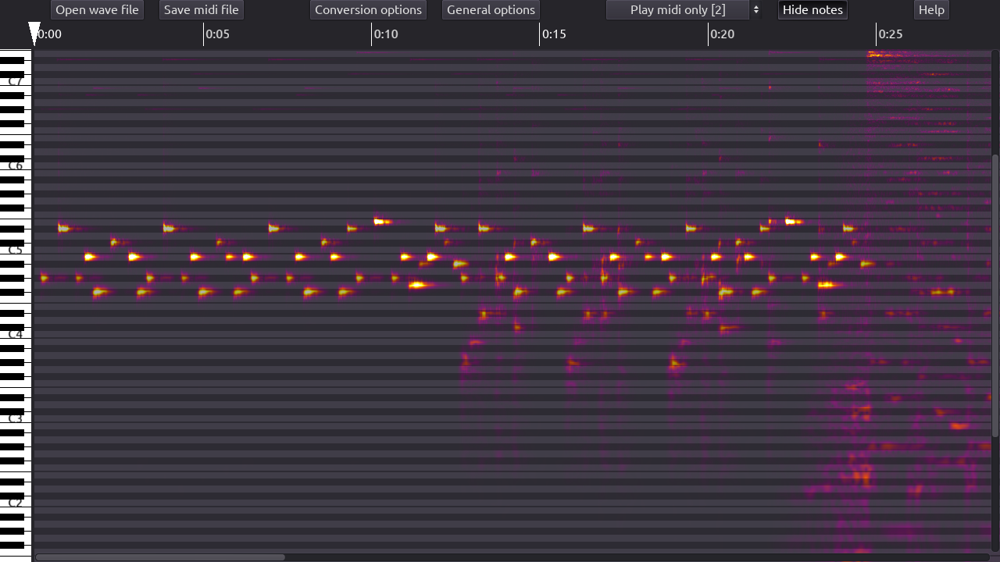
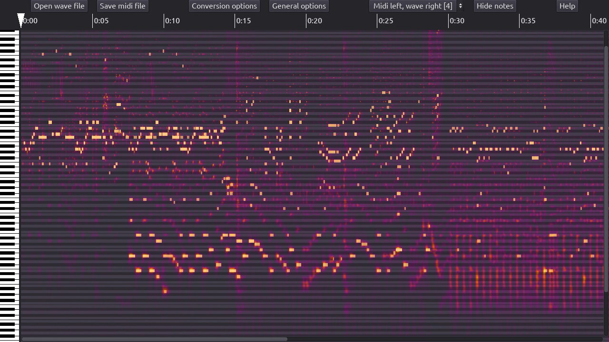
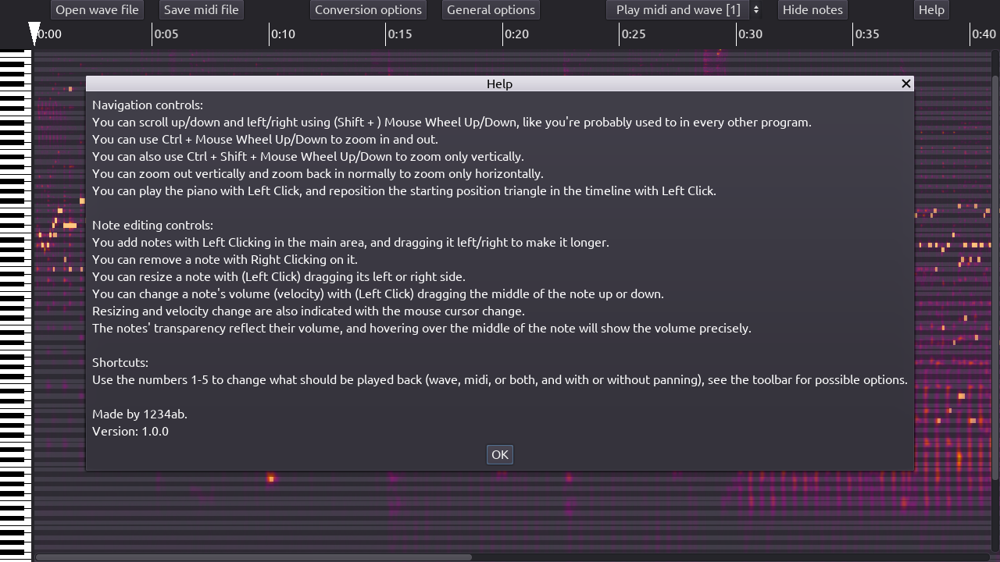
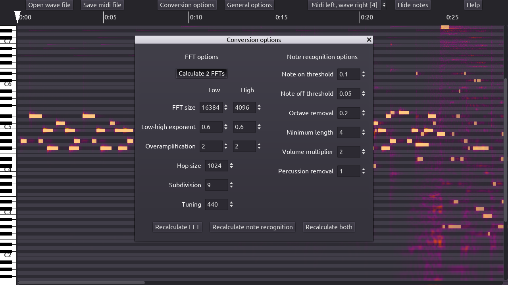

#  MeloMIDI
An interactive wave to midi editor, music transcription software made in Godot. Supports Linux and Windows.  
Basic features are working, but there's plenty of room for improvement.

## Usage
Download the program from the [Releases](https://github.com/4321ba/MeloMIDI/releases).  
Extract it, and run the MeloMIDI_x.y.z executable. You don't need to install it.  
The program will freeze when opening a file, that is normal for now.  
Example with [Approaching Nirvana - Forest of Wonder](https://www.youtube.com/watch?v=MWOaYWuKnNw):  
  
If the output midi is less than usable, the program can still help with the spectrum image of the piece:  
  
Another example, the [Cover Orange 2 BGM](https://www.youtube.com/watch?v=3lAxymSLD9c):  
  

### Expect the program to crash
Be sure to save frequently if you're working on a bit larger project, there are NO backups created! Currently we have no unique file format, but you can still save the midi file, and if the program does crash, you can load the wave file back up, continue working from where you left off, and after finishing, copy the first part and second part midi files together with an external program. It's still better than redoing the whole thing. If it does crash, [report it](https://github.com/4321ba/MeloMIDI/issues), so we can fix it!  

### Controls
We try to use the most intuitive shortcuts and mouse controls, but if you get stuck, you can take a look at the in-program help, that lists all of the available ones.  
  

### Options
MeloMIDI tries to give as much customization in the recognition as possible, so the users can accomodate it to very different pieces of music.  
  
You can view the description of an option in the conversion options popup, with hovering over the number input box. Feel free to open an [issue](https://github.com/4321ba/MeloMIDI/issues) if something is hard to understand!  
We try to give sane defaults, but there may be pieces where the recognition can be greatly improved with tweaking. For classical and piano music, see Overamplification e.g.  

## Contributing
If you find a bug or have a cool feature request, be sure to open an [issue](https://github.com/4321ba/MeloMIDI/issues)!  
For a basic roadmap you can take a look at [TODO.txt](TODO.txt), but you can still open an issue about a feature that's in there so we can see the interest in it.  
If you would like to create a pull request, please also open an issue first, so that we can talk about it, and if it maybe turns out that it is out of scope or something else, you don't work for nothing.  

## Modifying the program
* Download the source code from the [Releases](https://github.com/4321ba/MeloMIDI/releases).  
* Download [Godot 3.3+](https://godotengine.org/download) if you don't already have it.  
* Run Godot and open the project with it.  
* Hit F5 to run the program.  
* Now you can modify the it and instantly see the changes.  

See also [Compiling spectrum_analyzer.cpp](#compiling-spectrum_analyzercpp).  

## Compiling spectrum_analyzer.cpp
There's already a compiled version in `project/bin` in the Releases version of the source code, and you can modify most parts of the program without changing the GDNative/NativeScript part. See [Modifying the program](#modifying-the-program) for that.  
However, if you want to modify the core (C++) part of the spectrum analyzer (fft calculation, image creation, note recognition algorithms), you need to compile `spectrum_analyzer.cpp`.  
We use the CMake build system for building. You'll need to install some dependencies if you don't already have them.  
These include: `git` for getting the submodules, `cmake`, then a build system that CMake generates (like `make`), `python` for godot-cpp's binding generation and a C++ compiler like `gcc` or `clang` (or `mingw` or `msvc` for Windows).
After cloning the `main` branch (or downloading the source from the releases, that's generally more stable, but older), you need to `git submodule update --init --recursive` inside the root folder (`MeloMIDI` or `MeloMIDI-main`) to get the submodules (the command may be different on Windows).  

### Linux
Then either run `source/build_linux.sh`, or something similar to that.  

### From Linux to Windows
Either run `source/build_windows.sh`, or something similar to that. The toolchain file is provided.  

### Windows
Run CMake, and with that you should either generate a Makefile if you're compiling with MinGW, or generate a Visual Studio thing if you're using MSVC, but I don't know that part.  

### Mac
If someone is interested in a Mac port, I'd gladly help, but I can't test it. Compiling `spectrum_analyzer.cpp` and testing are the bottleneck in supporting it, Godot supports it otherwise pretty much out of the box as far as I know.  

## Used software
* [Godot](https://github.com/godotengine/godot) game engine 3.3+ for everything.  
* [Godot Midi Player](https://bitbucket.org/arlez80/godot-midi-player/src/master/) for playing and saving MIDI in GDScript.  
* [GDScriptAudioImport](https://github.com/Gianclgar/GDScriptAudioImport) for importing audio at runtime into godot streams.  
* [Godot-cpp](https://github.com/godotengine/godot-cpp) bindings for high performance calculations and library integration.  
* [Kissfft](https://github.com/mborgerding/kissfft) for easy to use Fast Fourier Transform calculations.  
* [Libnyquist](https://github.com/ddiakopoulos/libnyquist) for decompressing audio into raw audio data in C++.  

## Similar projects
* [AnthemScore](https://www.lunaverus.com/) I can't deny the influence their front page had on this project :D. It's very similar, has more features but it's proprietary. It is actually a really good program, you should definitely try it out. +1 for their good Linux support too.  
* [WaoN](https://github.com/kichiki/WaoN) A very old, mostly dead project I used a little bit. The output from complex pieces isn't that usable, it's cool though and free / open source.  
* [ISSE](https://sourceforge.net/projects/isse/) A very capable program to separate sound sources, also free / open source, though it wasn't updated in years.  
* [Melodyne](https://www.celemony.com/en/melodyne/what-is-melodyne) I never used this but it looks amazing. And expensive. It is proprietary.  
